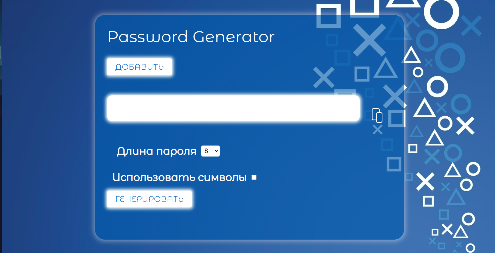
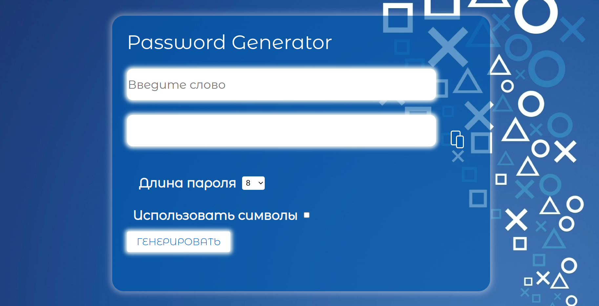
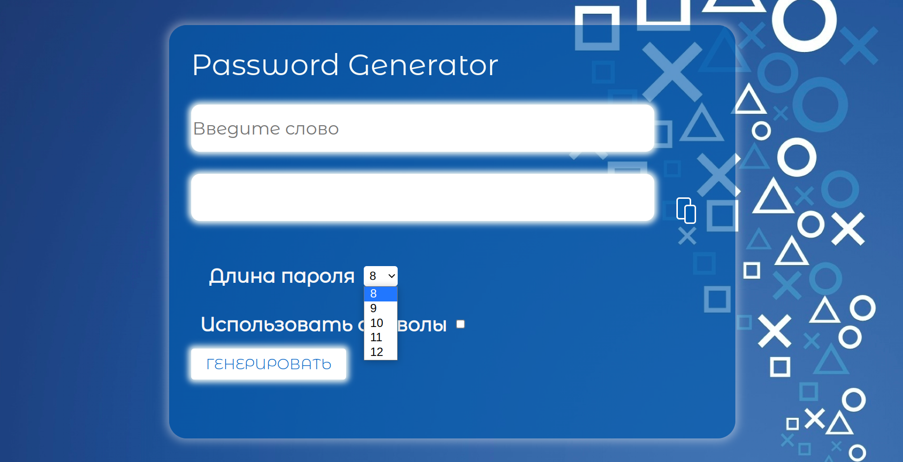
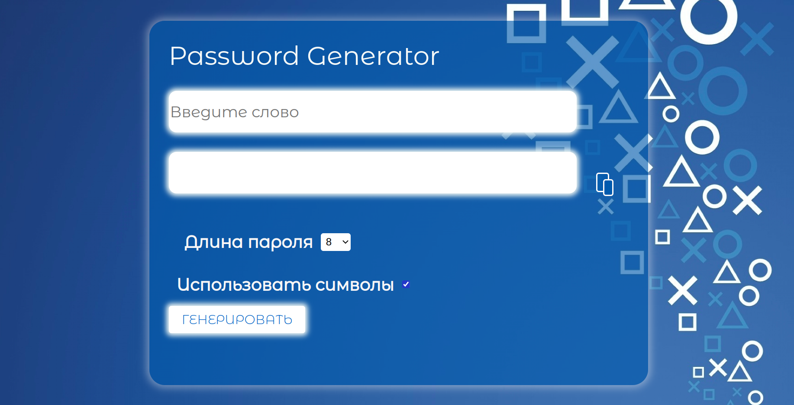
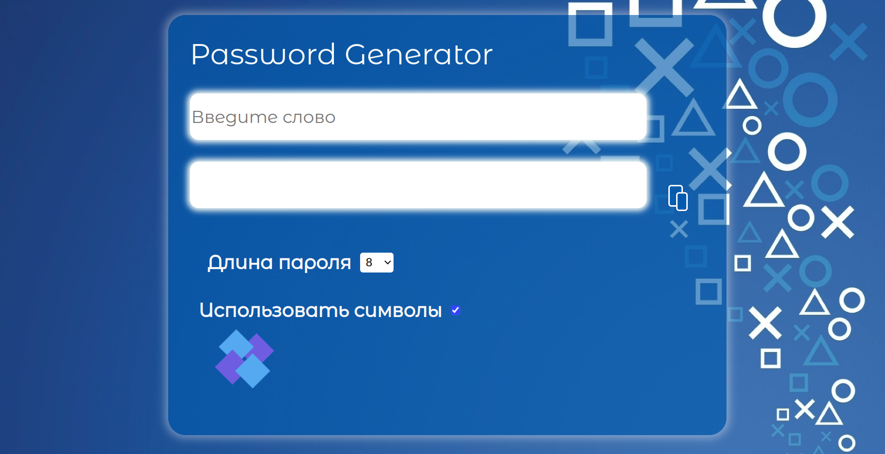

### This is a web application for password generation.

### functional:

### <li> it is possible to add a keyword

### <li> the ability to choose the length of the liassword

### <li> possibility to add symbols

### <li> animated download 

### <li> it is possible to copy the text

 
### Deploy to vercel:
https://password-generate-virid.vercel.app/
